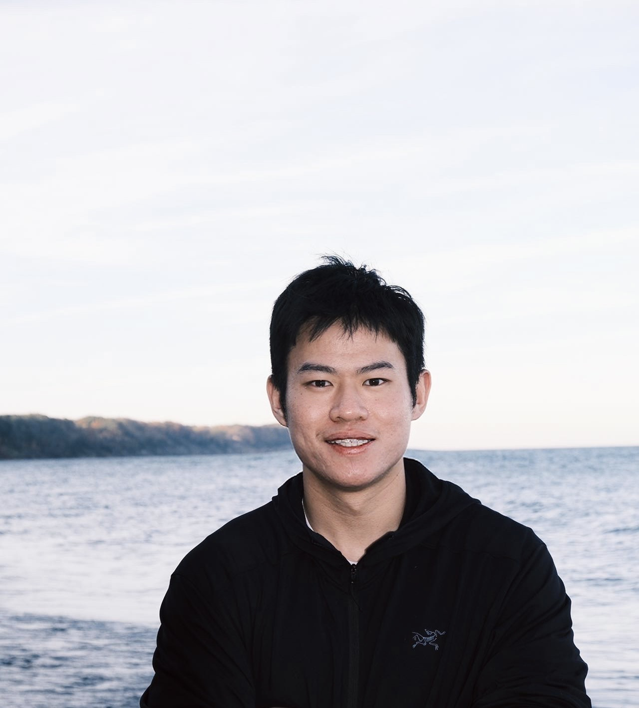

---
title: "Welcome"
format: html
---

  
  <h3>Ruoqian Wu ｜吴若谦</h3>
  
Always looking for new ideas, collaborators. Feel free to reach out me :)

 
<a href="mailto:rw41@illinois.edu">rw41@illinois.edu</a>

  

    
    
  

<!-- Static visitor map -->

  

Hello and welcome! I am a second-year M.S. student in the 
<a href="https://education.illinois.edu/edpsy/programs-degrees/queries" target="_blank">
Quantitative Methods (QUERIES)
</a> program at the University of Illinois Urbana–Champaign (UIUC), where I work under the supervision of 
<a href="https://education.illinois.edu/profile/yan-xia" target="_blank">Prof. Yan Xia</a>. 
I expect to graduate in Spring 2026 and will begin my Ph.D. in Quantitative methods at UIUC  in Fall 2026.

My current research interests include:

<ul>
  <li>
    Developing and applying machine learning and AI-driven methodologies to address complex methodological challenges in behavioral research, with particular emphasis on intensive longitudinal and multimodal data.
  </li>
</ul>

</ul>

